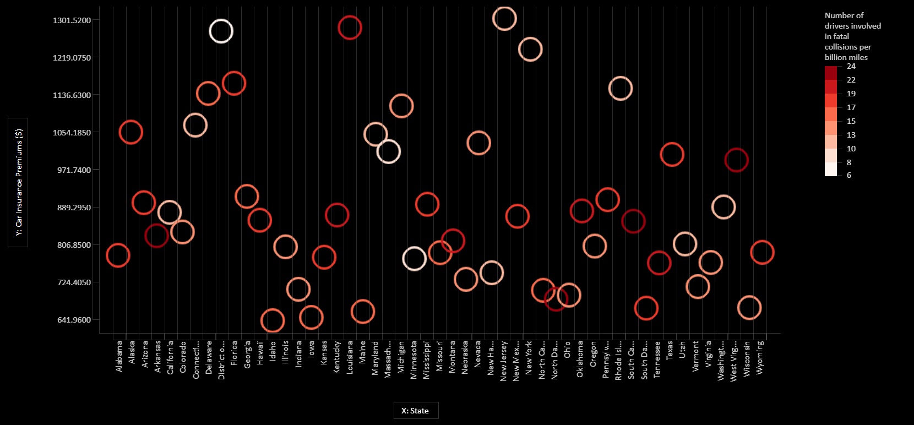
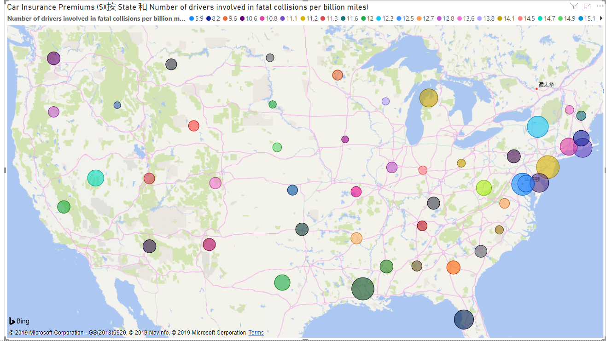
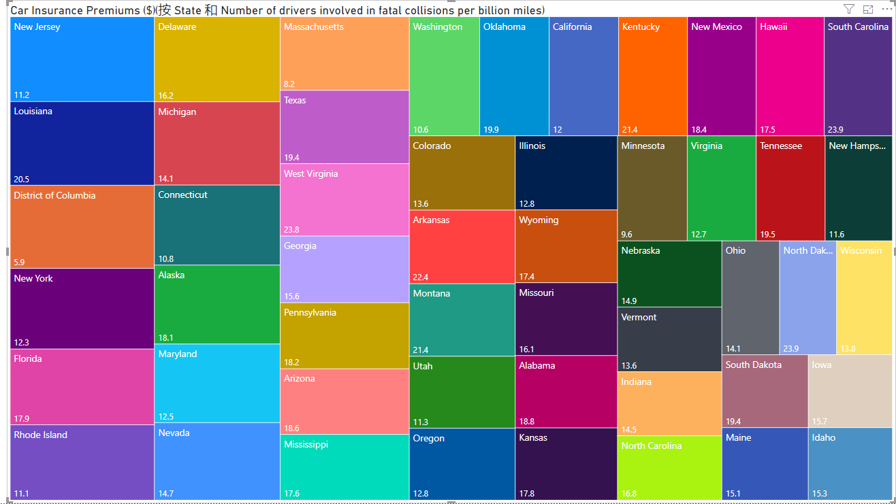
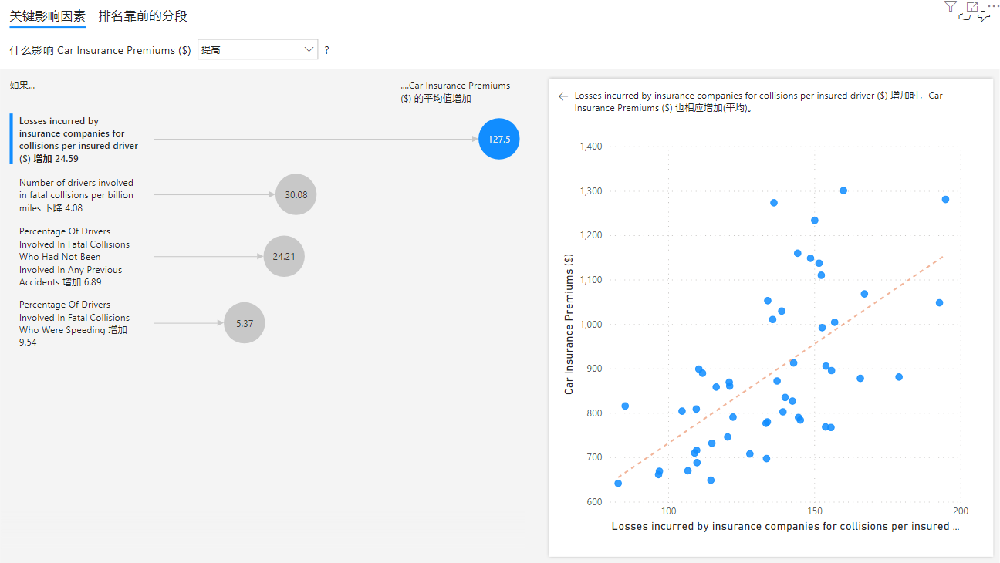
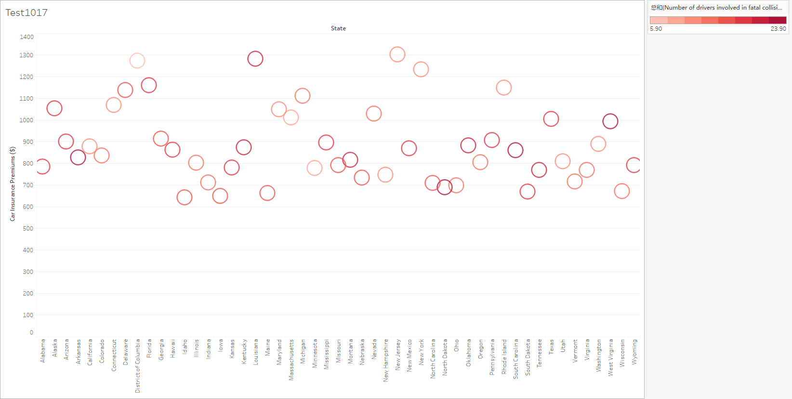
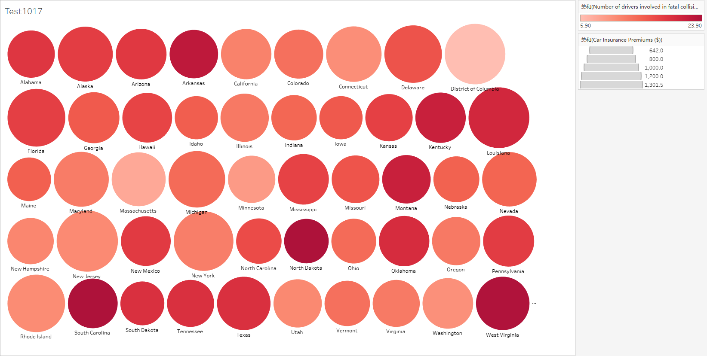
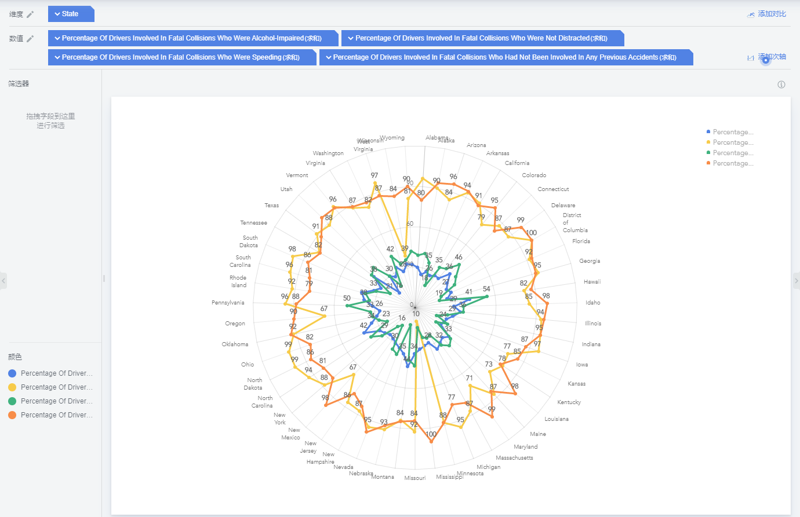

## 第三周作业

  
对国内外目前免费可视化图表工具的调研

   
　　目前国内免费的可视化图表工具有<a href="https://www.wentu.io/">文图</a>，<a href="https://www.tubiaoxiu.com/">图表秀</a>，<a href="https://dydata.io/">镝数</a>，<a href="https://tushuo.baidu.com/">百度图说</a>，<a href="https://me.bdp.cn/home.html">BDP</a>和<a href="http://hanabi.data-viz.cn/">Hanabi</a>等,这些基本是注册账号后，通过在线网页，选择预置模板直接生成图表，各个工具的易用性与自由度实际差别较大，<s>像百度的图说我是真的不太会用，</s>国内的话还有开源的<a href="https://www.echartsjs.com/zh/index.html">ECharts</a>，涉及代码，更注重数据分析。  
  
　　国外的在线工具有<a href="https://venngage.com/">venngage</a>和微软的<a href="https://www.sanddance.ms/">SandDance</a>等，离线工具有Tabulea Public和Power Bi等，谷歌系的可视化工具有Google Charts和Google Data Studio。此外，Excel和R应也属免费的可视化图表工具。

  
对公开数据集的选取与数据呈现

   
　　此处选取的相关可视化工具有SandDance，Power Bi，Tableau Public和BDP
　　我选用的数据集名为<a href="https://www.kaggle.com/fivethirtyeight/fivethirtyeight-bad-drivers-dataset">FiveThirtyEight Bad Drivers Dataset</a>，通过Kaggle对此数据集的简介，可以了解到此数据集包含有美国五十个州及华盛顿特区的致死交通事故和车险费用的相关数据，数据源来自美国国家公路交通安全管理局和全美保险专员协会。
　　我首先选择了免注册的在线工具SandDance，这款工具图表其实较少，多次尝试后，考虑到图表呈现，我基于不同州，选取“Number of drivers involved in fatal collisions per billion miles（每十亿英里里程涉致死交通事故的司机数量）”和“Car Insurance Premiums（车险保费）”两个指标做了散点图，x轴为各州，y轴为“车险保费”，以颜色的加深来指征可以体现事故率的“每十亿英里里程涉致死交通事故的司机数量”。为了方便数据的查看，又加上了平行于y轴的辅助线。

　　然后我下载了Power Bi和Tableau Public，Power Bi预置图表就可以直接以地图形式呈现数据，而且识别美国各州，就尝试做了一个（截图放弃了夏威夷和阿拉斯加），效果一般。

还有一个树状图

　　时间有限没来得及具体研究，颜色我暂时只会一个一个改，有时间做成阶梯性的会好一些。Power Bi貌似还有个数据分析的功能，计算不同指标的相关度。
分析结论是数据集里没什么指标和涉致死交通事故的司机数量有关，不过2010年保险公司的人均理赔支出会影响2011年的车险保费。

　　Tableau Public里我主要做的是和前两个工具的对比，散点图我还是更喜欢SandDance，比起Power Bi不成形的气泡地图，Tableau Public这种展现形式似乎也不错。
　　

　　数可视和百度图说暂时没找到调参数的地，就注册了BDP，作为国内在线工具的体验。
　　由于是国内工具，做地图似乎仅对中国地图友好，做了个之前被放弃数据的雷达图。

  
对相关工具的使用体会

   
待更新

