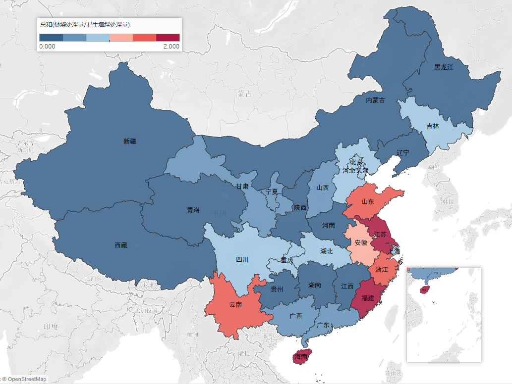
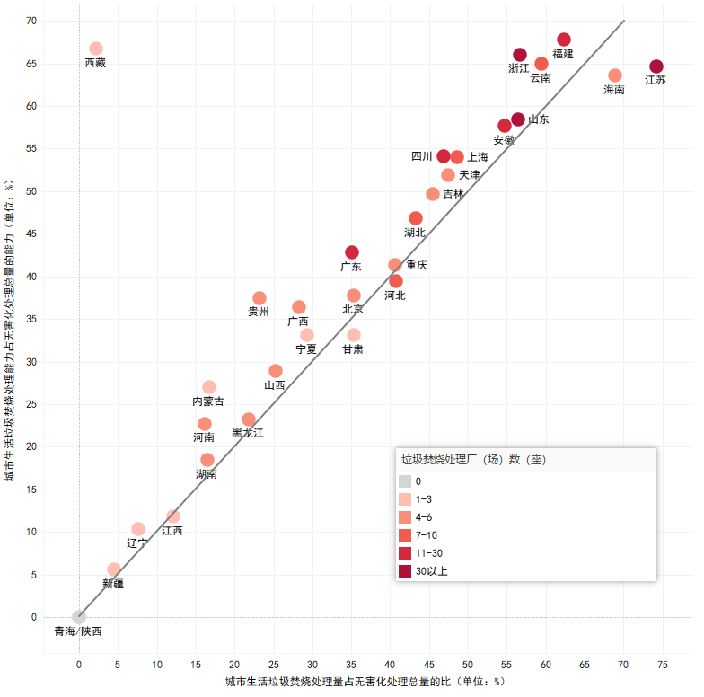

## 第四周作业

  
图文呈现

   
  
### 生活垃圾是烧的多还是埋的多？

　　上海市垃圾分类制度的实施引发了我们对于城市生活垃圾处理的关注。在分类之后，不可回收的垃圾会被怎么处理？中国城市建设统计年鉴的数据显示，2017年全国城市生活垃圾的无害化处理，57.2％以卫生填埋的方式进行，40.2％采用了焚烧的方式。  
　　分省来看，国内仅有七个省市的城市生活垃圾“烧的比埋的多”。（数据统计不包括港澳台）

　　我国土地资源短缺、城市人口密集，长远来看，对于城市生活垃圾的无害化处理，采用焚烧的方式要比填埋更为现实与环保，这一点，也得到了政策的支持。  
　　根据国家《“十三五”全国城镇生活垃圾无害化处理设施建设规划》，到2020年底，我国城市生活垃圾焚烧处理能力要占无害化处理总能力的50%以上，其中东部地区要达到60%以上。在未来，生活垃圾“埋的比烧的多”的现状，将会被逆转。 
　　不过值得注意的是，从现有数据来看，在大部分省份，垃圾焚烧处理量与其垃圾焚烧处理能力并不相符。  
  

　　可以看出，江苏、海南等少数几个省份，垃圾焚烧处理量在无害化总处理量中的占比，要高于垃圾焚烧处理能力在无害化总处理能力中的占比，可以视为焚烧为主的垃圾无害化处理模式较为成熟。其他大部分省份，垃圾焚烧厂的饱和程度不如卫生填埋场等其他无害化处理设施，实际的垃圾焚烧处理量，还没有追上垃圾焚烧处理能力的增长。  
　　另一方面，推广焚烧未必适合所有的省份。西藏仅有一座城市生活垃圾焚烧处理设施，垃圾焚烧处理能力占到了总处理能力的近七成，可实际处理量却不到总处理量的四十分之一。在相对地广人稀的西部地区，如青海、陕西一样以更为经济的卫生填埋来进行无害化处理，暂缓垃圾焚烧产业的建设，也许倒更为合适。  
　　垃圾无害化处理产业的建设，非朝夕之功。无论是烧的多还是埋的多，只要因地制宜，符合实际，更环保、更经济、更符合可持续发展的需要，我们皆喜闻乐见。

  
过程步骤

   
  
* 数据来源：中华人民共和国住房和城乡建设部《2017年城市建设统计年鉴》

* 参考资料：国家发展改革委、住房城乡建设部《“十三五”全国城镇生活垃圾无害化处理设施建设规划》  

* 数据收集：  

　　我首先进行了有关“垃圾”的数据收集，个人认为，有关“垃圾”的统计数据，在国情差异与统计标准不一的问题现实存在的背景下，国家间的直接进行数据比较，只能做议题切入点，重点会落到政策措施等各方原因的比较分析上；结合个人兴趣，我仅对国内有关“生活垃圾”的数据进行了搜索。简单查询就可确定，生活垃圾的相关数据，来源基本都是住房和城乡建设部的每年的《中国城乡建设统计年鉴》。此外的数据，多为部分研究机构或学者根据调研及公开资料的估算或预测，这部分数据易受到权威性的质疑，部分数据又因商业化有一定获取难度，遂决定仅以住建部的《统计年鉴》为信源，在此基础上绘制图表。

* 数据分析：  

　　报道角度的思考参阅第三部分“思考过程”，确定了重点做各省城市生活垃圾焚烧处理发展情况后，我首先对数据进行了初步的筛选与汇总，只做两张静态图表，数据的二次处理利于实现比较与相关性分析。我首先计算了生活垃圾焚烧处理量与卫生填埋处理量的比值，这是契合议题的重要数据。  
　　而后我又计算了生活垃圾焚烧量在无害化处理总量中的占比与生活垃圾焚烧能力在无害化处理总能力中的占比。这样计算的理由是，我的重点在于垃圾焚烧，卫生填埋其实仅作话题引入与一个比较，这样以无害化处理总值就更为合适。而且我以为，前者是焚烧作为无害化处理方式的应用现状，后者则是理论上、规划中的前者期待值，两者的比值，可以反应理论与现实的产业结构布局的差异情况。
  
* 呈现步骤：  

　　制图工具我选择了Tableau Public，图表呈现的细节调整也基本在其中完成。  
　　第一张是地域间的整体情况，以地图形式呈现，红蓝两个颜色，六个色阶。可以直观看出议题的答案。  
　　第二张需呈现两个二次计算得到数据的相关性，散点图形式再好不过。添加辅助参考线，数据关联性也就被直观地呈现。以颜色指征垃圾焚烧厂数量其实有考虑过删除，不过貌似不影响其他数据的呈现，就留着了。

  
思考过程

   
  
　　报道角度的思考实际也与数据收集、分析与呈现的过程并行。在搜索查阅了相关资料后，我相信了在未来一段时间内，焚烧是更为合适的生活垃圾处理方式。随后，我又在十三五规划中看到了国家对垃圾焚烧的重视，遂决定参考规划中的考量方式进行切入，并以“焚烧”作为侧重点。采用排除法：城乡差距影响因素较多，县、镇与乡村的统计值缺失较多，按一般影响力城市较大，遂确定依据《城市统计年鉴》，即只取 __城市生活垃圾__ 做题，放弃县镇乡村的数据；历年变迁涉及统计方式变更等等问题，于是确定只做最新，即2017年的数据；考虑到数据处理能力与一般报道模式，从省际考量相关数据。总之即是，做2017年各省城市生活垃圾焚烧处理的分析。议题开展和其他数据的选择，实际也围绕这一点进行。   
　　看到各项数据的第一反应，大概是考虑数据与事件的关联以及数据间的关联，不过实际情况往往是影响因素较多，数据值存在缺失等等问题，也就难以发掘到数据的显著相关性，单纯的数据复制又未免无趣。《统计年鉴》中其实有垃圾投资的相关数据，可惜没有下设更详细的小类。分省垃圾焚烧处理的数据较为完整可靠，大概也是我选取这一议题的重要原因。
  

