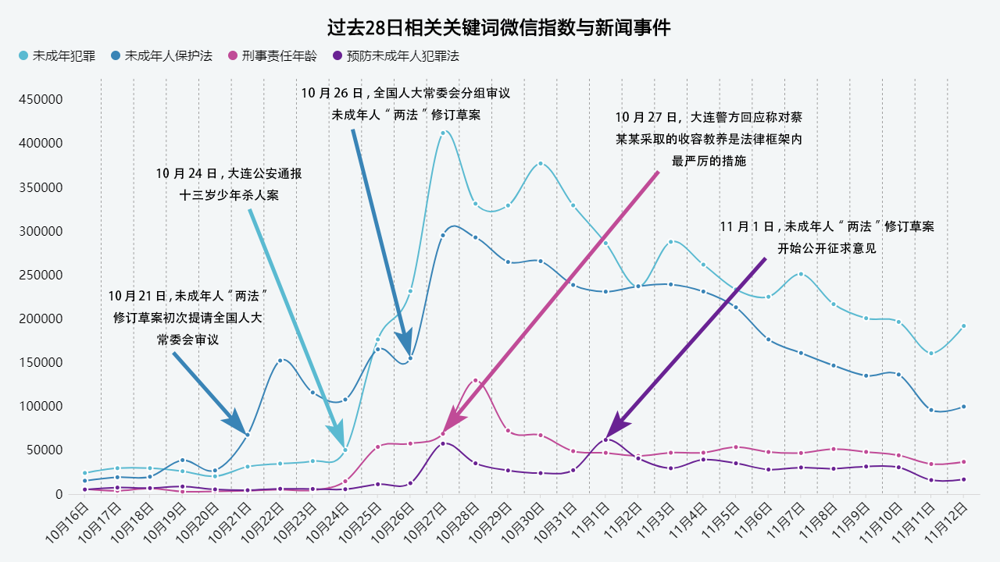

## 第五周作业

  
图文呈现

   
  
### 当我们谈论未成年人犯罪

　　10月24日，大连公安发布警情通报：20日晚，一名13岁少年杀害一名10岁女童，已依法对少年进行收容教养。通报发出后，舆论哗然，质疑对13岁少年的处理是否过轻。由此案件，近来《未成年人保护法》和《预防未成年人犯罪法》这两部有关未成年人的法律的修订也受到了越来越多的关注，其中，常常被提起的问题是，是否要降低刑事责任年龄，以打击、威慑未成年人犯罪。  
　　我们找到了未成年人犯罪相关讨论的四个关键词：未成年犯罪、未成年人保护法、预防未成年人犯罪法和刑事责任年龄。   
　　这四个关键词的微信指数显示，10月21日人大常委会开始审议未成年人“两法”之前，对未成年人犯罪和未成年人法律修订的讨论都相当有限，24日大连13岁少年杀人案，让人们对未成年犯罪的关注直线上升，并带动了相关关键词指数的增长。27日大连警方的回应，则引起了“刑事责任年龄”讨论的一个小高潮。  
　　

　　显然，近来对未成年人犯罪的关注，实质是围绕大连13岁少年杀人案，值得警惕的是，从未成年犯罪和未成年人保护法两个关键词指数量级接近、变化趋势几乎一致的情况来看，谈论未成年犯罪时，舆论焦点指向了《未成年人保护法》而非《预防未成年人犯罪法》，对《预防未成年人犯罪法》的关注甚至不如对刑事责任年龄的关注。  
　　刑事责任年龄实际由刑法第十七条具体规定，而《未成年人保护法》第五十九条规定：对未成年人严重不良行为的矫治与犯罪行为的预防，依照预防未成年人犯罪法的规定执行。《预防未成年人犯罪法》第三十七条规定：未成年人有本法规定严重不良行为，构成违反治安管理行为的，由公安机关依法予以治安处罚。因不满十四周岁或者情节特别轻微免予处罚的，可以予以训诫。  
　　不难看出，未成年人犯罪问题在法律层面，最相关的其实是《预防未成年人犯罪法》。当我们谈论未成年人犯罪，我们谈论最多的却似乎是法律对未成年人的保护是否“过度”、如何让未成年罪犯不受“保护”从而得到“严惩”，而不是预防未成年人犯罪的措施如何完善。  
　　根据《中国法律年鉴》的数据，近年来，刑事罪犯总数呈缓慢增长趋势的同时，未成年刑事罪犯数连续数年下降。  

　　未成年人犯罪率不断下降，实际上说明，在现今的刑事责任年龄设置下，对违法犯罪的未成年人，实行教育、感化、挽救的方针，坚持教育为主、惩罚为辅的原则，并没有如人们所担心的那样“煽动未成年人犯罪”。法律的威慑作用面对恶性犯罪时，相当有限，为了少数极端个例而要求降低刑事责任年龄是不合逻辑的。谈论未成年人犯罪，不妨更多考虑未成年人犯罪的预防，找到继续控制未成年刑事罪犯数的有效路径。  

  
过程步骤

   

* 选题方向：  

　　关于法律问题，大多数时候，我相信并支持国内法学界的主流态度，这次应该也没有例外。   
　　看完新闻由头和关键词，决定往未成年人犯罪的方向做，这方面看到的相当一部分声音在呼吁所谓的刑事责任年龄的降低，惯常说法是“不能纵容未成年人犯罪”，我相信轻刑化是历史发展的必然趋势，也就难以认同这样的观点。据我了解，近年来我国的司法实践也一直朝着轻刑化在努力，“主流舆论”对此的不认同确实值得关注。  
  　　基于我支持轻刑化的立场，也就确定了选题的大致方向，通过数据说明刑事责任年龄降低、加重刑罚对预防犯罪的无用，或是说明对未成年人犯罪继续坚持“少捕慎诉”原则、加强保障未成年犯罪嫌疑人合法权益的必要。总的来说就是，试说明，对未成年人犯罪，预防和教化比规制和惩戒更有效。  
  
* 数据获取：  

　　找数据过程中我遇到的最大问题是，14周岁以下未成年人的犯罪率，即使有统计结果也依法不能公开。  
　　按照选题方向进行了数据的初步查找和相关信息搜集，我得到的数据实际上相当有限，官方信源理论上有法院检察院和公安部，然而公安的数据我找不到……查询到的，一般都是司法部门的工作报告和新闻发布会，其统计时间八成是某年一月至今年某月(某月一般是数据发布时间上一个月)，且数据条目也不一致。简单来说，可以对单次发布会作解读，但做不了具体统计指标的趋势分析。法院有个数据中心，有出专题报告，不过没提供原始数据；检察院历年工作报告涉及未成年人部分的统计指标都不带重的，无规律可循。仅有的成体系发布的官方信源是《中国法律年鉴》，不过这玩意有获取门槛。最后的数据获取，我是通过国家统计局负责的页面解决的，数据来源其实就是《中国法律年鉴》，不过可用的相关统计指标只有刑事罪犯总数和青少年刑事罪犯数等。  
　　我还是排除了国外数据，新闻由头和假想受众都是中国，越是与社会背景相关的议题，国外数据的借鉴意义就越有限。个人认为，就此议题而言，综合考虑社会环境和法律体系，仅限日本、德国等少数国家(最多加上新加坡韩国法国俄罗斯)的数据和制度具有参考价值。能找到的数据有各国刑事责任年龄，然而这些国家基本和中国一致，没必要做图表；未成年人犯罪率等数据，试着找了日本的，不过受限于现实条件，没找到能用来为我国未成年人犯罪预防做参考的。  
　　还是感谢百度，找数据过程中我想起有搜索指数这样的东西，或许可以做舆情分析。综合参考了百度指数、搜狗指数和微博指数，结果确实符合我的期待，最后选择用微信指数来做呈现，是因为搜狗和微博数据量不行，百度一般还是搜索指数，在现今恐怕主动用搜索引擎获取信息的占比相当少了，用微信指数反应舆情贴切一些。微信指数我用小程序查的，统计到CSV文档，选择这四个关键词的理由，是可以借之反应我想说明的东西。  

* 数据分析：  

　　首先是微信指数，分析思路是检索“关键词+转折点日期”，查找到转折的原因，予以标注分析。
然后是法律年鉴的数据，题是未成年人，我放弃了青少年的数据。一个小问题是，所谓的“未成年刑事罪犯数”，一是意味着依法不捕、不起诉的犯罪嫌疑人未在其中，二是意味着14周岁以下，依法不认为犯罪的不予统计。虽然数据反应未成年人犯罪率在降低，根据相关部门的工作报告和部分年鉴数据，未成年犯罪嫌疑人的不捕率、不起诉率是上升态势，青少年占总人口数的比例呈下降态势，要估计这部分的影响，会有数据获取和处理上的难度，未移交司法机关的犯罪更是无从统计，考虑到各种因素，青少年犯罪的实际情况，可能会比“未成年刑事罪犯数”所反应出来的更严重一些。  
　　我的图表没有考虑这些因素的影响，是因为查询相关数据后，我粗略计算的结果是这些数据没有改变未成年人犯罪率在降低的总体趋势，在我的立场，这些数据，尽管让图表更贴近实际情况，但不会改变总体事实，作用大概仅是分散受众关注。  

* 数据呈现：  

　　这次我用了镝数和PS，Tableau Public还是不算熟，而且似乎图表形式相对有限。毕竟要都是要反应时间变化，看了几种图还是觉得折线图最好。为了避免做两张折线图，第二张用的是折线图+柱状图，更需要被认识到同时趋势也更明显的“未成年刑事罪犯数”保留了折线形式。第一张图做的时候考虑过堆叠层叠之类的，不过我需要每一个词的趋势，还是折线图最好。折线图是曲线还是直线犹豫了一下，选的是曲线。PS水平一般，箭头的样式也许可以有更好的处理方式。

  
信源链接

   

* [微信指数](https://kf.qq.com/touch/wxappfaq/170418jamiYn170418NzEVFJ.html?platform=15)
* [国家统计局](http://data.stats.gov.cn/)
* [全国人大常委会会议今召开 将审议多部重要法律草案](http://www.chinanews.com/gn/2019/10-21/8984596.shtml)
* [大连公安微博通报十三岁少年杀人案](https://m.weibo.cn/1760668437/4431028712583237)
* [十三届全国人大常委会第十四次会议分组审议未成年人保护法修订草案、预防未成年人犯罪法修订草案等 栗战书参加审议](http://www.xinhuanet.com/2019-10/26/c_1125156195.htm)
* [大连杀女童凶手被收容三年，警方称是法律框架内最严措施](http://www.bjnews.com.cn/news/2019/10/28/642469.html)
* [未成年人保护法修订草案等6部法律草案开始公开征求意见](http://www.xinhuanet.com/2019-11/01/c_1125181915.htm)
  

