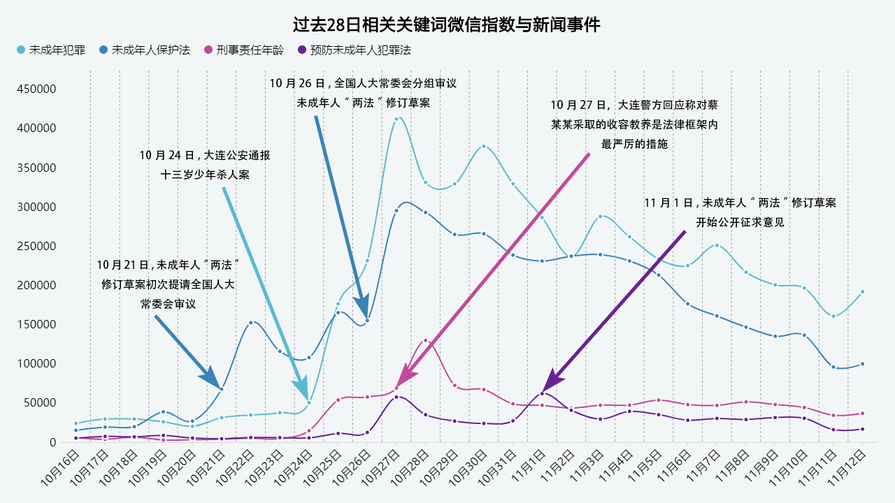
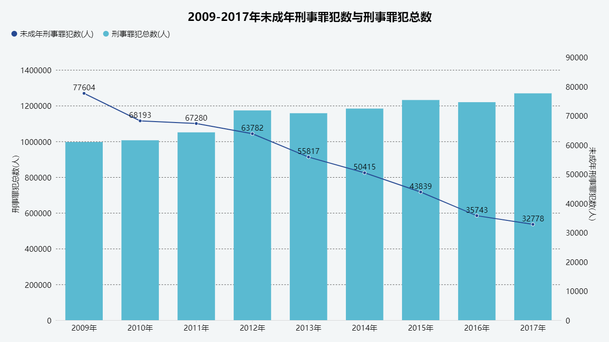
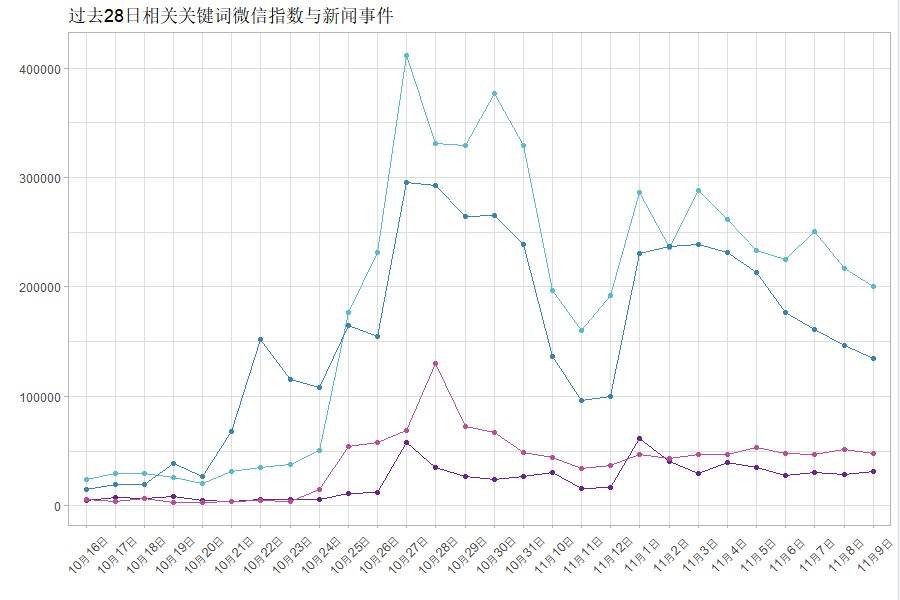
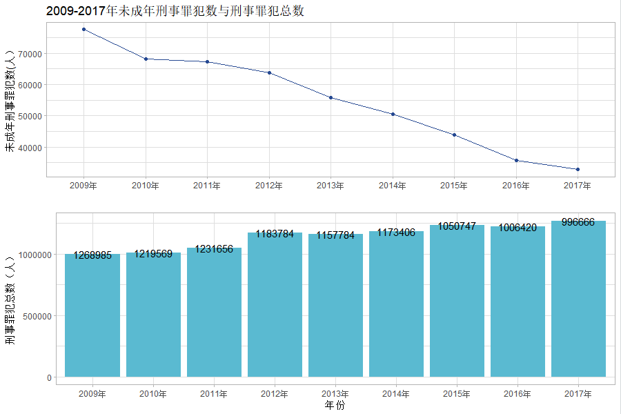

## 第七周作业

### 原图





### ggplot图





### 代码

* 图一代码

```

library(ggplot2)
data1 <- read.csv("weixin_r.csv")
ggplot()+
geom_line(data1,mapping = aes(x = date ,y = wcnfz ),group = 1,colour = "#5abad1")+
geom_point(data1,mapping = aes(x = date ,y = wcnfz ),group = 1,colour = "#5abad1")+
geom_line(data1,mapping = aes(x = date ,y = bhf ),group = 2,colour = "#3984b6")+
geom_point(data1,mapping = aes(x = date ,y = bhf ),group = 2,colour = "#3984b6")+
geom_line(data1,mapping = aes(x = date ,y = yff ),group = 3,colour = "#692293")+
geom_point(data1,mapping = aes(x = date ,y = yff ),group = 3,colour = "#692293")+
geom_line(data1,mapping = aes(x = date ,y = xznl ),group = 4,colour = "#c04b97")+
geom_point(data1,mapping = aes(x = date ,y = xznl ),group = 4,colour = "#c04b97")+
labs(title="过去28日相关关键词微信指数与新闻事件",x = "",y = "")+
theme_light()+
theme(axis.text.x = element_text(angle = 45, hjust = 0.5,vjust=0.5))

```

* 图二代码

```

library(ggplot2)
options(scipen=200)
data2 <- read.csv("chuli_r.csv")
p1 <- ggplot(data2,mapping = aes(x = year,y = juvenile),group = 1)+
geom_line(colour = "#264992",group = 1)+
geom_point(colour = "#264992")+
labs(title="2009-2017年未成年刑事罪犯数与刑事罪犯总数",x = "",y = "未成年刑事罪犯数(人）")+
theme_light()
p2 <- ggplot(data2,mapping = aes(x = year,y = total))+
geom_col(fill="#5abad1")+
geom_text(colour = "#000000",label = c("996666","1006420","1050747","1173406","1157784","1183784","1231656","1219569","1268985"))+
labs(x = "年份",y = "刑事罪犯总数（人）")+
theme_light()
library(ggpubr)
ggarrange(p1,p2,nrow=2)

```

### 事项

* 还是按复刻的方向做的，第一张图图例、说明之类还有补充改进的空间
* 最头疼的问题是不太习惯RStudio的界面和一些基础操作指令
* 部分代码是复制粘贴后改的，还没有确定是否多了什么不必要的参数变量
* 图二结尾代码似乎有R包版本支持的问题，貌似没影响出图
* 没整明白读取数据的时候，首行是中文怎么处理，暂时是把源数据改成了英文
* 导出图片时RStudio报错的问题还在解决中，暂时是截的图
