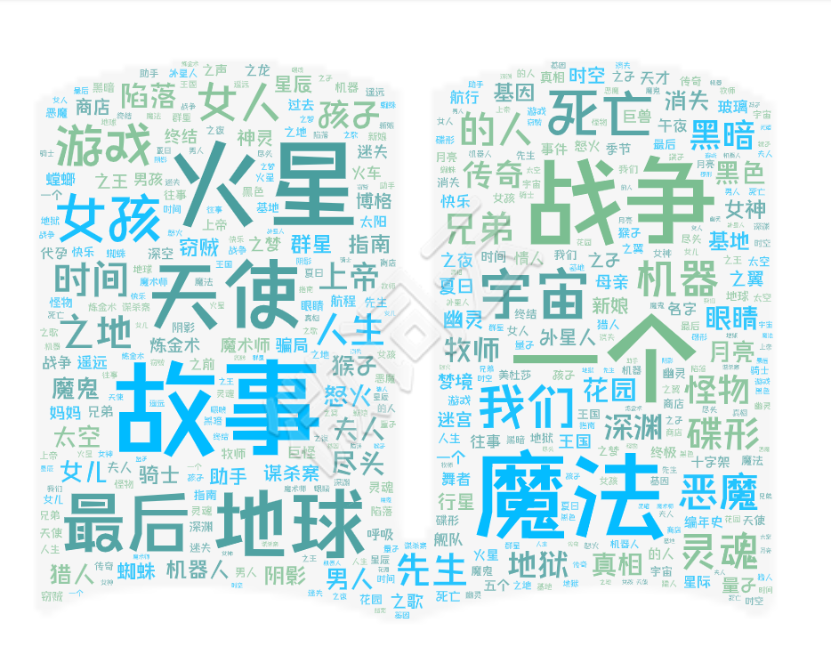
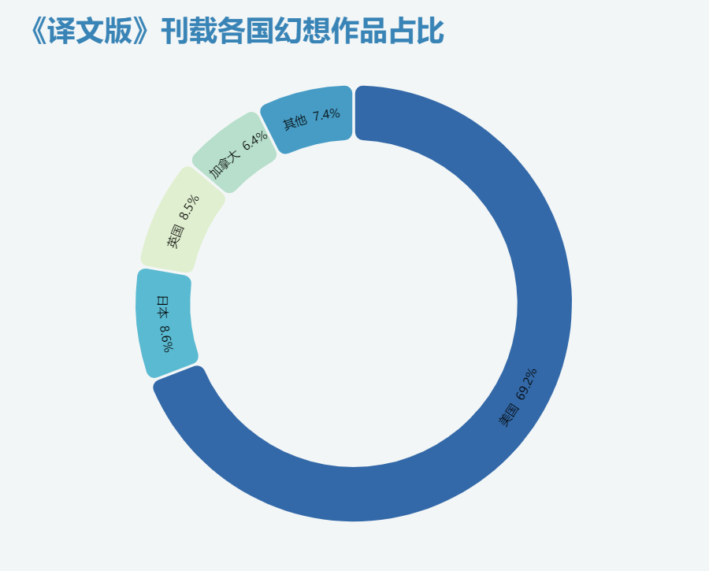
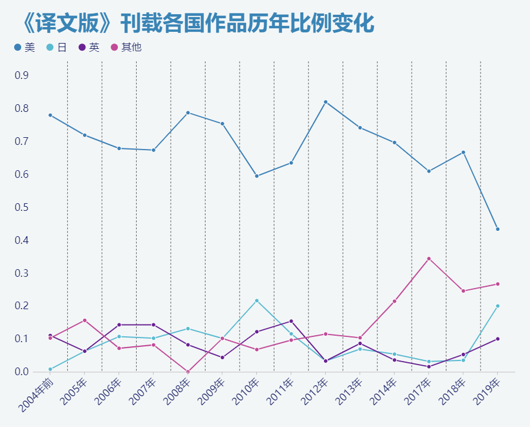
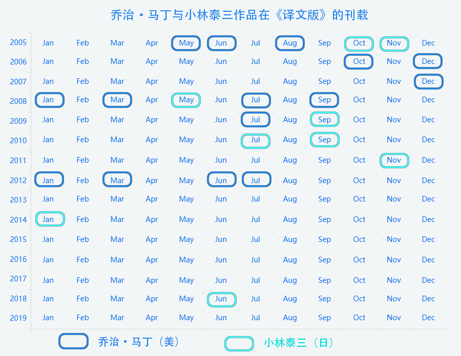
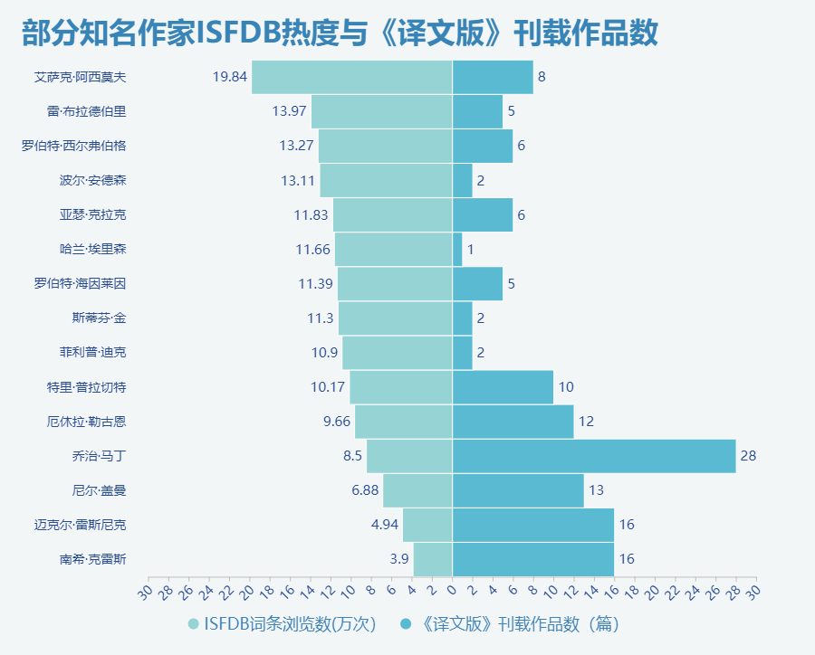

## 结课作业

  
成品链接

   
  

  

  
图文呈现

   
  
### 《科幻世界·译文版》与她带来的作品、作者与译者

　　2019年8月16日，成都正式申办2023年第81届世界科幻大会。对于许多科幻迷而言，成都是国内当之无愧的科幻圣地，因为《科幻世界》在成都。  
  　　今年是《科幻世界》创刊40周年，很长一段时间里，《科幻世界》杂志是国内唯一一个科幻作品发表平台，如今，中国绝大部分的科幻作家都来自《科幻世界》。
《科幻世界》不仅仅是读者认识中国科幻作者的平台，更是世界幻想文学中文译介的领头羊。近年来国内得以认识世界幻想文学近况，《科幻世界·译文版》(以下简称《译文版》)功不可没。  

* 《科幻世界·译文版》 

　　一般认为，《科幻世界》1995年至2004年发行的29本增刊是早期的《译文版》。这些增刊集中刊登了国外科幻名家的著作。  
　　2004年，在当年1月份增刊的刊名之中，“译文版”这一名称出现。  
　　2005年，《译文版》正式设立，每月出版，不再以增刊形式发行。这一年的《译文版》单月刊名称是《科幻世界·译文版》，双月刊名称则是《科幻世界·幻想小说译文版》。单月科幻为主、双月奇幻为主的刊选方针沿用至今。  
　　2006年起，《译文版》的刊名统一定为了《科幻世界·译文版》，以《科幻世界》本刊下半月版的形式发行。  

* 作品  

　　1995年至今，在《译文版》上刊载的幻想小说共计1033篇。对这些作品刊发时中文译名做词频分析的结果显示，标题里常常出现的字眼是故事、魔法、火星、战争、地球、天使、一个与最后。  
  

　　从作者国籍上看，美国作家的科幻作品占据了绝对的多数，日本、英国、加拿大紧随其后，其他国家的作品则只占7.4％，这样的分布情况实际也与当今的幻想文学现状大体相符。  
  

  
　　值得注意的是，从历年的占比情况来看，近年来《译文版》越来越多地将视线转向了其他国家的优秀科幻作品，并与日本的早川书房在互相介绍两国优秀作品这一点上达成了良好的合作。这些原因使得近年的《译文版》在引入的作品愈发多元化。  
  

  

* 作者  

　　在《译文版》上出现最多次的作家是乔治·马丁，从2005年5月的《沙王》到2012年7月的《战区周末假》，七年间，《译文版》刊载了乔治·马丁的作品共计28篇。2008年1月和2009年7月的乔治·马丁专辑也让他成为了唯一在《译文版》拥有两期专辑的个人作家。  
　　出现最多的日本作家则是小林泰三，从2005年10月日本恐怖小说专辑中刊载的《玩具修理者》到2018年6月日本奇幻文学专辑中刊载的短篇小说《幽灵》，小林泰三在《译文版》刊载作品共计10篇。  
　　从这两位作家在《译文版》刊载作品的时间，或许可略见国内读者对他们的认识轨迹。  
  

* 译者  

　　如果仅看少数知名作家的情况，英文语境下人们对幻想作家的关注与《译文版》的引进情况并不一致。  
　　ISFDB这个世界最大幻想文学数据库词条被浏览最多的十位作家与在《译文版》刊载作品数最多的五位作家，没有重合。甚至于，这些知名作家的ISFDB热度与在《译文版》刊载作品数是呈反比的。  
  

  
　　作品的引进需要版权、作者、读者与出版社，更离不开译者。ISFDB热度前10的作家里，排第十的特里·普拉切特在《译文版》刊载的作品数甚至超过了排第一的科幻名家艾萨克·阿西莫夫，普拉切特的刊载在《译文版》的10篇作品，有6篇都是由胡纾翻译。近年来小语种作品引进数的上升、日本幻想文学专辑的发行，其背后都有着译者的影响。  
　　如果说《科幻世界》是培养了中国的科幻作家，《译文版》就是培养了中国的科幻奇幻译者。从老一辈的孙维梓、王荣生，到中生代的李克勤、赵海虹与丁丁虫，再到新生代的胡纾、耿辉等等。稳定、活跃的译者群体是《译文版》生命力的保证。   

　　由于杂志社本身不具备出版发行图书的资质，《译文版》引进的小说多是由四川科学技术出版社出版，有着《译文版》优秀的引进渠道和培养起来的译者群体作支撑，四川科学技术出版社在国外科幻奇幻作品引进出版领域长年占据着近乎垄断的地位。近年来，随着大家对科幻文学的关注度上升，越来越多的出版社投入到了国外幻想佳作的引进，《译文版》对于世界幻想文学的中文译介。  

  
过程描述

   

* 数据来源：1995年-2019年《科幻世界·译文版》目录

* 选题想法：  
　　选择做这个题，起因是近期正好产生过补充完善《科幻世界·译文版》目录的想法，做可视化的话，这个数据也是我最近感兴趣的内容之中，可搜集度比较高的一个。做译文版的一个重要原因，实际上是《科幻世界》在国内同类出版物的垄断地位，译文版基本可以视为引进国外幻想小说的风向标。在这样的背景下，就此目录的分析，实际上也就基本是分析国内对国外幻想小说的认识。 
  
* 资料搜集：  
　　我有联系过杂志的编辑，他们是否有目录的官方版本，得到的答复是，即使是他们四五年前官方分享过的版本，实际上也是来自“热心幻迷”的整理，因此她建议我直接去豆瓣和论坛找。找了一找发现目录之外，相关资料还挺集中的，主要就是2010年至2013年间豆瓣的帖子，顺着找下去发现已经有人在做一个更具野心的数据库，要统计世界上所有科幻作家作品中文翻译情况。可惜这个数据库不计数，而且译文版部分数据源实际也是豆瓣的帖子，毕竟错误都一样。借之又了解到，有人在做一个“久隆计划”，有收集译文版目录，按要求申请数据后才知道这份目录暂时没做电子化。于是核心数据源就变成了我自己在现有资料基础上整理的版本，现有数据的质量比想像的要差不少，有的作者中文译名有三四个，近年的数据只有相当简单的参数。试过严格规整数据，发现这样的工作量对期末作业而言过于大了，时间受限，就根据淘宝店的版权页和多看阅读的目录信息，在豆瓣帖子的基础上补充完善，按照能计数的要求做了个版本。

* 确定框架：  
* 视觉呈现：  
* 参考资料：  

